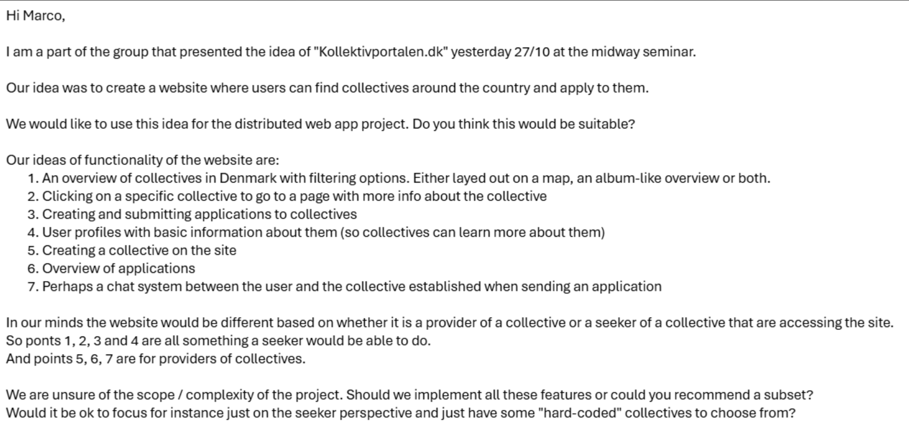

# DistributedWebProject

- Punkt 1-6 indføres. Punkt 7 er ekstra funktionalitet som vi ikke overvejer for nu.

- Seeker:
  - Overview of collectives
  - Info about individual collectives
    - name of provider
    - collective description e.g
  - Create/Submit Applications to individual Collective
  - Has basic info for collective to see.

- Collective Provider:
  - Create collective
  - Get overview of all applications

C-E ToDo:

- Lav først UML-diagram over overordnet User Flow.

Overvejelser:
- Måske ét låst kollektiv til hver Provider?

- Items:
  - Seeker
    - email (authentication)
    - password (authentication)
    - name
    - description
    - birthdate
    - gender
    - locationNow
    - job/study
  - Application
    - description
    - date
    - userID
    - collectiveID?
  - Collective
    - email (authentication)
    - password (authentication)
    - name (of provider)
    - address (for display when listed)
    - description
    - image
    - space
    - residentsAmount
    - vacantSlots
    - location